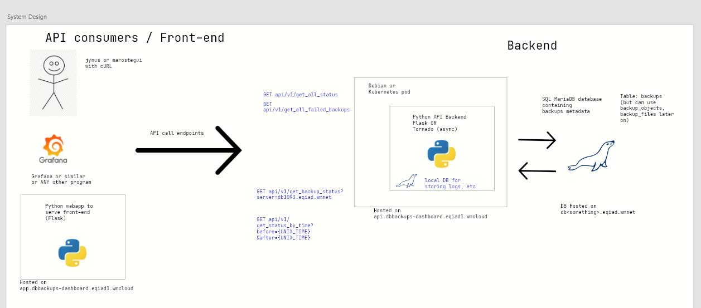
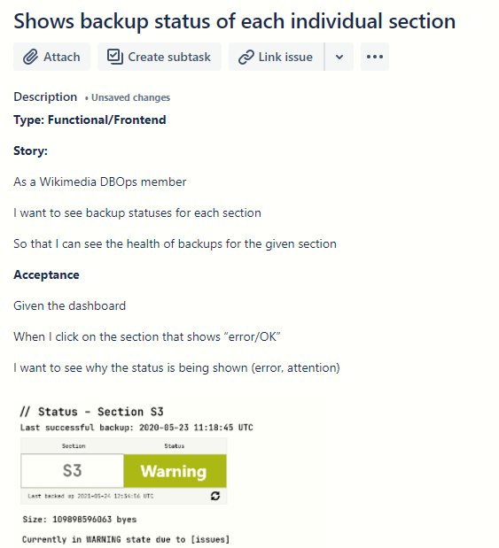
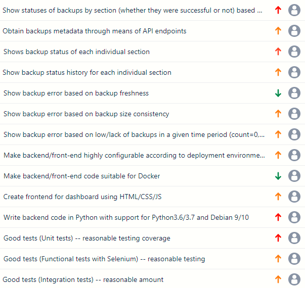
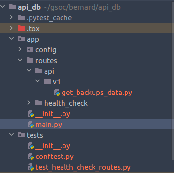

# Gathering requirements, researching frameworks, creating an abstract system design, and initial coding :technologist:
## 14th June 2021

In my previous post, I had briefly mentioned about how I was introduced by my mentors to the ethos of Wikimedia, which is to empower and engage people around the world to collect and develop education content.

 ***Imagine a world in which every single human being can freely share in the sum of all knowledge. That's the idea.*** 
 
 The same is true for any code that will be written in this project -- it will be open sourced, it will encourage open collaboration, just like Wikipedia. I had also briefly mentioned about ways of communicating, such as use of IRC and Wikimedia Phabricator for communicating progress with mentors. I had also promised that I would discuss the finalised requirements of the project for mid-evaluation milestone and will be in a position to talk about the project requirements and perhaps some code as well :grinning:

 ## Creating a system design

 The first couple of weeks of GSoC was spent with my mentors trying to understand the requirements of our project from my mentors (our clients) and then trying to come up with a system design that suits our use case properly. The below image is an overview of the system architecture of our entire project. It is highly abstract but it should give a good overview

 

 So basically, the project objective is to obtain data from an SQL database (in our case, MariaDB), and then expose it through APIs (Application Program Interface). A web frontend would then consume the data from the API and show it in a very user friendly manner. As we are creating an API, our project will be very extensible, and we can build other applications with our API. (and the use case will not be limited to just our webapp)

 At a glance, we will be using the software architechtural pattern known as Model-view-viewmodel (MVVM). Model–view–viewmodel (MVVM) is a software architectural pattern that facilitates the separation of the development of the graphical user interface (the view) – be it via a markup language or GUI code – from the development of the business logic or back-end logic (the model) so that the view is not dependent on any specific model platform. In our project, the business logic/back-end logic would be served by the APIs, and the front-end would be served by a combination of Flask/Jinja for templating + HTML/CSS.

 The app will be split into two components

 - API App -- This program is the middleman between the user and the database. It exposes DB data through API endpoints

 - Web App -- This program uses the APIs to serve the data to a front-end

 We could combine both of them into one application, but that would make it difficult to maintain it.

 ### Backend
 The backend will consist of a Python application (written in FastAPI) whose sole job is to listen to requests through endpoints and then serve them by getting the data from the database.

 We are using FastAPI as it is purpose built for creating APIs and it is on par with the performance of Node.js as it uses asynchoronous functions / non-blocking methods to process requests. It is also very straightforward and simple to understand.

 We will call this application the "API App"

 For example, say we have a GET request to a server
 ```
 curl -X 'GET' \
  'http://localhost:8282/api/v1/get_recent_backups_data' \
  -H 'accept: application/json
```

This would then print out a response like the below (full output removed for readability)

```
{ "name": "dump.s1.2018-07-03--17-57-43",
  "status": "finished",
  "started_at": "2018-07-03 17:57:40",
  "size": "49500645964"
  "section": "s2"
},
```

This output is obtained from the SQL table using a library called SQLAlchemy, which is a popular tool for connecting our Python application with an SQL database.

You can find the schema for the SQL data here https://phabricator.wikimedia.org/diffusion/OSWB/browse/master/sql/dbbackups.sql


### Frontend

This will be made using Flask/Jinja templating due to it's simplicity, and will grab the data from the APIs to represent the data. This will be a separate application to the API App.


## Agreeing goals for the project

In order to agree to goals, we need to prioritise features and know what feature we are supposed to be building.

In order to prioritise features, stories/tickets were made and then the tickets were prioritised with my mentors through a Google hangouts meeting. An example of tickets used are below. I used Jira (free to use for small projects) to draft the tickets, and the important tickets would then be ported to Wikimedia Phabricator to keep things clean.

### But what's a story?

A user story is an informal, general explanation of a software feature, usually written from the perspective of the end user. It's main purpose is to articulate how a software feature will provide value to the customer.

Each story would contain the information about the requirements, and the criterias needed for a story to be considered "complete" (also known as acceptance criteria)

As I had discussions with my mentors, I wrote down the requirements that they had mentioned, and then started converting these requirements into stories. The requirements mainly consist of Functional requirements (eg. backup of each section should be shown) and Non-functional requiremenets (eg. software should run in Debian 10)


 
Figure: An example of a story

### Priorities, priorities

It is so easy to get overwhelmed with a bunch of stories and tickets. Therefore it is important to walk through the tickets/stories with your mentor and find out what's relevant by helping them prioritise the features that they want the most.


 
Figure: Ticket drafting using Jira


## Goals agreed for the entire project

It is quite easy to get carried away and think that one should implement all the stories/features mentioned by our client/mentors, (I did this) but it is also important to start from the simplest features first. Taking the words from my mentor to basically underpromise and overdeliver (best advice ever), we agreed to the following goals for mid-evaluation

- Show statuses of backups by backup sections 
- Program should support Python 3.6 and above versions
- Program should run on Debian
- We should be able to stand up the project in the Wikimedia Cloud servers
- Dashboard should not take forever to load (1s loading time as a minimum)
- Should have decent unit testing
- Should have good documentation

## Goals agreed for mid evaluation

- Working API backend to expose some data from the backups table (one endpoint should do)

- Minimal front-end with dashboard (of perhaps 1 metric, eg. such as backup failed on one of the sections, etc)

- Reasonable unit testing

## Goals for first sprint (June 7th - June 21st)

For coding objectives, I have decided to stick with 2 weeks sprint and agree to deliver certain features by the end of the sprint. For the week starting June 7th to June 21st, I will be trying my best to deliver the following

- Complete API skeleton code, have some templates for unit test

- Show a demo with API responses

- Show redoc or OpenAPI documentation (automatically generated)

- Deploy the app locally and run it


## Code

I have started coding as of June 7th and I will be using existing Wikimedia's tox-docker job to validate that Python code follows standards [PEP-8] and we will be using a tool called Flake8 to enforce these standards. It is important to enforce these standards so as to improve and maintain consistent code readability.

Organising back-end code is a challenge that I am tackling at the moment, currently I have a barebone skeleton of an API without any business logic implemented. The picture below should give an idea of how things are organised currently.



Figure: Some simple code organisation, eg separating endpoints with routes

The main code for the application is in the app folder.


We are using `pytest` for unit testing of FastAPI, and these are in the tests directory

## Next report

In 2 weeks time, I will be hopefully be able to go through some of the organisation of the code and talk a bit more about the technical aspects of my project, as the coding session should be in full swing by then. I will also have made a good start to the front-end "app" part of the code and would also have finished with the first sprint as well. I should have lots to talk about by then (hopefully!) 

Hope you found this useful :grin: 

Thank you for reading and please reach out through "issues" if you have questions :) 


 


