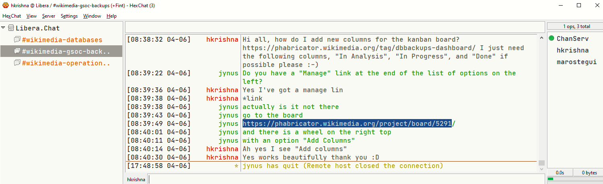

# An intro to Wikimedia, my mentors, and Wikimedia Database operations! :star:
## Report for activities upto 31st May 2021

### So what is my project?

In simple words, there are various backup processes that are scheduled automatically on various DB servers on Wikimedia. Most of the time these processes occur without any hiccups. Sometimes there are issues and raw error logs are sent through to IRC channels of Operations members. There are many logs occuring on a daily basis and it would be nice if we could use these errors to create a monitoring dashboard that would visualise the status of these backup operations (instead of relying on a raw error message)

### Day 0!

On 17th May, I found out that I was accepted to GSoC 2021. This isn't my first time applying to the programme and I was quite pleased to hear the news! :partying_face: 

This is the community bonding period, so without any further adieu, I thought I'd contact my mentors and establish some line of direct communication. 

### Establishing first contact

Well, not really first contact -- more like first contact since my proposal was accepted. I initially contacted my mentors through the Phabricator proposals to work on the microtasks to gain experience about the project and the backups codebase and obtained feedback from them for my proposal

The next day after my proposal was accepted, I very excitedly contacted my mentor(s) Jaime and Manuel through my phabricator proposal to arrange for a video chat ***(synchronous communication)*** and they helped me join the IRC channels for Wikimedia ***(asynchronous communication)***. 
I never thought of it that way until my mentors mentioned it to me. I thought it was quite cool and I think from now one I will refer to face-to-face talks/video-calls as sync communications :grin:

### How Wikimedia works, open communications and transparency

I learned through my mentors that all the work that Wikimedia does is open source and public, and that any communication, even IRC and any meeting/discussion that would be/were held, it's outcomes and discussions are made public to ensure transparency :innocent: (I would think that's the case unless this was related to security related issues or anything where "secret" passwords would have to be changed)

I've never used IRC before, it's quite minimalistic, looks old school and cool, and I think it gets the job done. It is hosted on an free network known as Libera, which is also used for communications by other open source orgs, such as CentOS and many many other cool open source projects :sunglasses:

Figure: An image of the IRC software that I use, and the channel in which we "asynchronously" communicate for small GSoC related questions and for scheduling meetings with my mentors (you can see me ask a question :grin:)

For GSoC, the discussions and the outcomes would be posted in Phabricator (a suite of code collaboration and ticket management tool). If there were/are issues with Wikimedia, whether related to codebase or security, a ticket would be raised in ***Wikimedia Phabricator***. Any code reviews would be done using the ***Gerrit*** tool

As for calls, we would do a videocall every week and this would be arranged by looking at our calendars (shared through Google Calendar -- how convenient! :smile:) and we would arrange a call during the week. 
This is however quite flexible.

### Support 

I've had amazing support from my mentors Manuel and Jaime :heart_eyes: -- they have onboarded me into the Wikimedia Cloud as my project requires me to create a monitoring webapp and I need to test it out on an environment which is a "close" replica to an actual Wikimedia production environment (but not quite). 
They have also supplied me with lots of documentation from WikiTech (a MediaWiki site where we document technical details of our operations and infrastructure) which helped me understand the database operations side of things and the daily work that are done by my mentors.

### Work done so far
I got to know the above in the weeks from May 17th - May 31st. Basically we were communicating through IRC and Google Hangouts (1hr+ every week) and we basically did the following

- We got to know each other and the understood work that my mentors do (Database Administration -- very serious business)

- Onboarded into Wikimedia IRC channels and resources (such as cloud virtual machines, etc, as my project needed it)

- Established a line of communication, some of which are 
    - Weekly scheduled meetings (every week)
    - Meetings on-the-fly scheduled through IRC
    - Set up a dedicated IRC channel where I can discuss GSoC stuff and primarily used for scheduling meetings and small questions
    -  Big questions and discussions go on Phabricator tickets/Presentation slides, you can find these in the epic tickets by following the epic link in the `README.md` file in the root of the repo)
    - Shared our calendars so that we can find a good time to meet

- Discussed system design and features that the monitoring web application would contain

- Set up our project repository on Gerrit

- Understood the scope of my project (which I will discuss more next week)

- Created front-end mockups and system design with Adobe XD (free software for creating mockups) 

The mockups are available at https://phabricator.wikimedia.org/T284030 and feedback was obtained from my mentors

### Coming next report

In a fortnight, I shall discuss the finalised requirements of the projet for mid-evaluation milestone and will be in a position to talk about the project requirements and perhaps some code as well :grinning: 

Until next time! :) 
